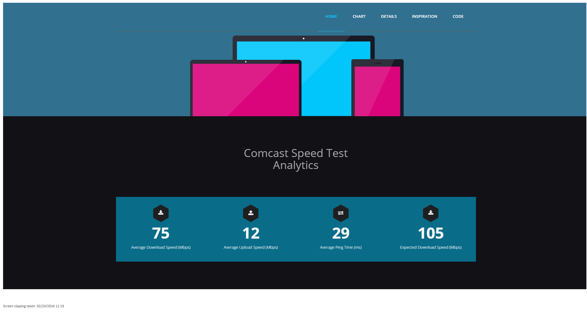
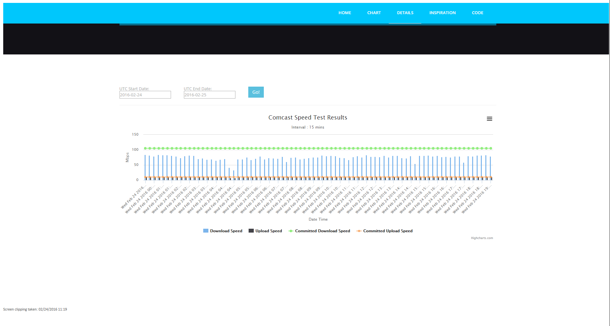
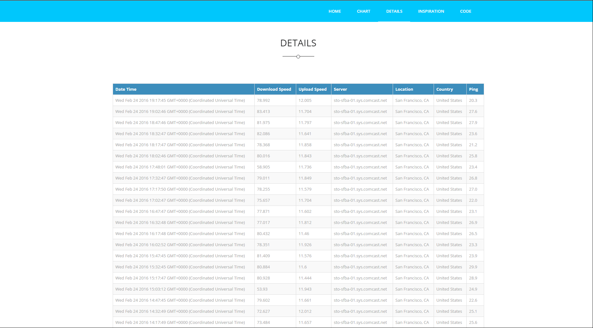

# Comcast Speed Test Analytics
This project contains 2 projects:
1.NodeWebApp- Report
2.SpeedTestIOT (to collect test data and store it in Azure) 

* SpeedTestIOT:
  * SpeedTest and collects data 
  * Store it in Azure Storage Tables
* NodeWebApp:
  * display Reports

Technologies:
  * NodeJS
  * Express JS -- (EJS engine)
  * HTML5
  * HighCharts
  * DataTableJS
  * Microsoft Azure Storage Tables

  
 TODO: Daily Average Speed is less than 50% than expected tweet webapp link. 
 
 Steps: 
  * Update config.js (both projects)
  * npm install (both projects)
  * node app.js (SpeedTestIOT)
  * node start (NodeWebApp)
  * 
  
ScreenShots
=============

